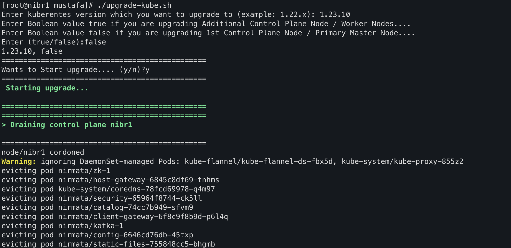

# Kubeadm upgrade Script

### This script will help you to upgrade your HA (High available) or Normal kubernetes cluster.

#### NOTE: This script works only on CentOS 7 or above OS.
#### NOTE: The upgrade procedure on control plane nodes should be executed one node at a time. Pick a control plane node that you wish to upgrade first.
#### NOTE: Pass node name as parameter argument with script if Node name is mentioned different with Kubernetes. 

#### Steps:
1. Clone / Download Script from repo.
    `git clone https://github.com/nirmata/custom-scripts.git `
2.  navigate to kubeadm-upgrade-script folder
    `cd kubeadm-upgrade-script`
3.  add excute permission to script.
    `chmod +x kube-upgrade.sh`
4.  run the script.
    - Pass node name as parameter argument with script if Node name is mentioned different with Kubernetes. 
    `./kube-upgrade.sh <node-name>`
5.  Script will ask you for follow values to enter.
    - Pass kubernetes version you wants to upgrade to. (example: 1.22.x)
    - Pass True/False
      - `False` Incase you are executing this script on your Primary Master/Control Plane node.
      - `True` Incase you are executing this script on Additional Master/Control Plane nodes or Worker Nodes.
  
#### Screenshot :

