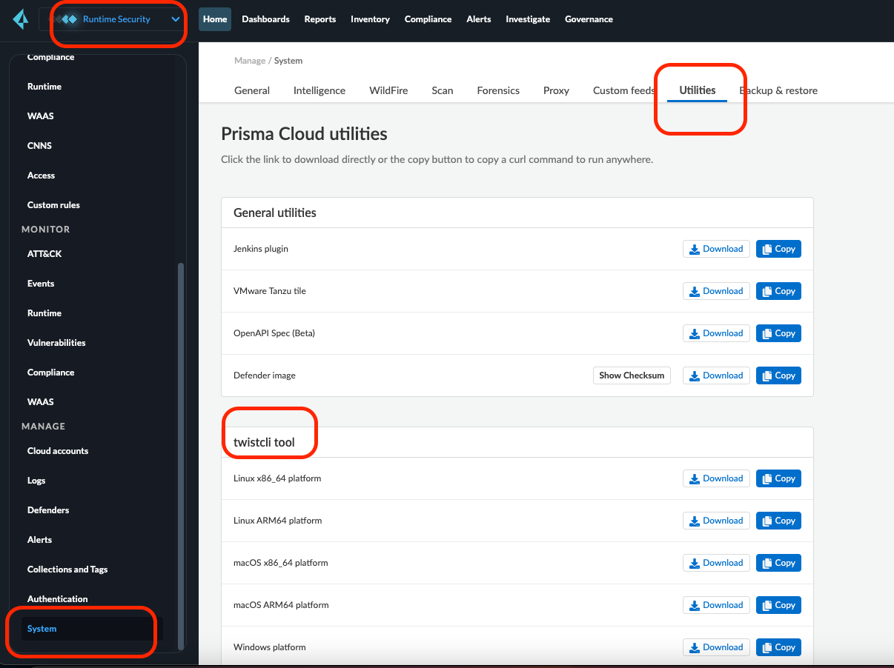

This repository consists of a script to scan the images for any vulnerabilities using Prisma cloud. Before running the script, ensure `twistcli` is installed on your machine as per your OS. 

## How to install `twistcli`

To install the `twistcli` login to the Prisma cloud account with your credentials. Go to `System` under  `MANAGE` which is under `Runtime Security`. Click on the `utilities` tab and download the `twistcli` binary as per your OS. Once downloaded, add the binary in the path so it can be executed from any location. See screenshot below for more details.

&nbsp;



&nbsp;

## usage: 

```sh

$ ./scan-images-prisma.sh images-to-scan.txt
Token generated successfully.
Pulling Docker image: ghcr.io/nirmata/background-controller:v1.12.5-n4k.nirmata.6

Scan results for: image ghcr.io/nirmata/background-controller:v1.12.5-n4k.nirmata.6 sha256:1acd9782762fe331ab55362d6071e8997511a64442ec3f431d6e9a7218b42b6c
Vulnerabilities
+----------------+----------+------+------------------------------------------+---------+-----------------+-------------+------------+----------------------------------------------------+
|      CVE       | SEVERITY | CVSS |                 PACKAGE                  | VERSION |     STATUS      |  PUBLISHED  | DISCOVERED |                    DESCRIPTION                     |
+----------------+----------+------+------------------------------------------+---------+-----------------+-------------+------------+----------------------------------------------------+
| CVE-2023-45288 | medium   | 0.00 | golang.org/x/net/http2                   | v0.22.0 | fixed in 0.23.0 | > 7 months  | < 1 hour   | An attacker may cause an HTTP/2 endpoint to        |
|                |          |      |                                          |         | > 7 months ago  |             |            | read arbitrary amounts of header data by sending   |
|                |          |      |                                          |         |                 |             |            | an excessive number of CONTINUATION frames.        |
|                |          |      |                                          |         |                 |             |            | Maintaining H...                                   |
+----------------+----------+------+------------------------------------------+---------+-----------------+-------------+------------+----------------------------------------------------+
| CVE-2023-46737 | low      | 5.30 | github.com/sigstore/cosign/v2/pkg/cosign | 1.22.5  | fixed in 2.2.1  | > 12 months | < 1 hour   | Cosign is a sigstore signing tool for OCI          |
|                |          |      |                                          |         | > 8 months ago  |             |            | containers. Cosign is susceptible to a denial of   |
|                |          |      |                                          |         |                 |             |            | service by an attacker controlled registry. An     |
|                |          |      |                                          |         |                 |             |            | attacker who...                                    |
+----------------+----------+------+------------------------------------------+---------+-----------------+-------------+------------+----------------------------------------------------+

Vulnerabilities found for image ghcr.io/nirmata/background-controller:v1.12.5-n4k.nirmata.6: total - 2, critical - 0, high - 0, medium - 1, low - 1
Vulnerability threshold check results: PASS

Compliance found for image ghcr.io/nirmata/background-controller:v1.12.5-n4k.nirmata.6: total - 0, critical - 0, high - 0, medium - 0, low - 0
Compliance threshold check results: PASS
Twistcli scan completed successfully for image ghcr.io/nirmata/background-controller:v1.12.5-n4k.nirmata.6.

```
